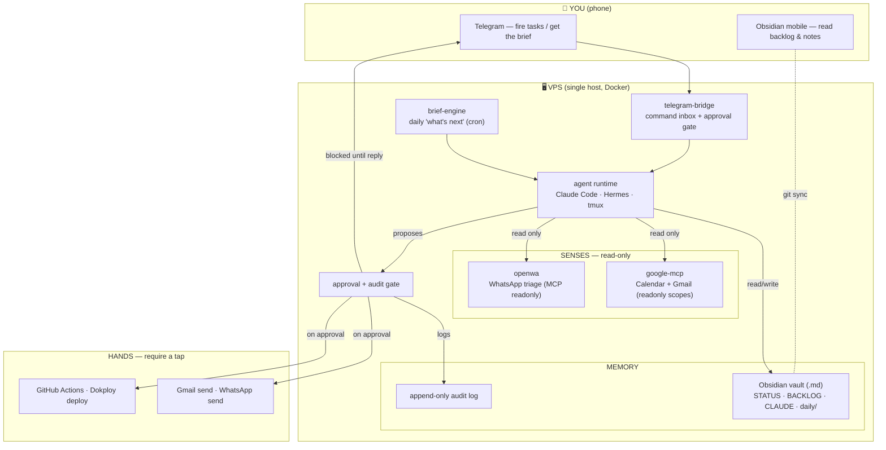

# 🤖 Bip Sidekick — Reference Architecture

> **Bip Sidekick — your beeping sidekick. It reads everything, suggests, and only acts with your OK.**
> _Seu ajudante que lê tudo, sugere, e só age com o seu OK._

A **self-hosted, governed, read-only-first personal agent** for solo builders and
consultants. It runs on a single VPS, reads from your real tools (Calendar, Gmail,
WhatsApp), and hands you **one prioritized next action** every day. It never *acts*
— sends, deploys, spends — without your explicit approval.

> Design principle: **Phone → Bip → your tools. It reads, drafts, and suggests.
> You approve anything that acts.**

## Meet Bip

Bip is a sidekick, not a boss-bot. Think Wall-E's heart and R2-D2's loyalty: it rides
along, shares the load, and beeps in when it has something for you — but *you're* the one
who decides. That personality is the architecture, not decoration:

- 🌅 Every morning, **Bip beeps in** with one prioritized action drawn from your real
  calendar, inbox, and backlog.
- ✋ When something needs to *act*, Bip asks first: _"🤖 bip? — send this reply to client
  X? [Sim] [Não]"_ — and waits for your tap.
- 📓 Bip keeps its memory in plain markdown you can read (your Obsidian vault), never in
  a black box.

The whole design keeps Bip on a short, friendly leash: **read-only by default, you
approve anything that changes the world.**

This repo is a **reference architecture**, not a turnkey product. The docker-compose
stack stands up the skeleton; each service ships as a minimal, documented stub so you
can build it out in the staged order described in [`docs/ROADMAP.md`](docs/ROADMAP.md).

---

## Why this exists

Most "autonomous agent" designs optimize for the agent acting *without you*. That
demands heavy machinery (opportunity engines, self-improving loops, spend controls).
For a solo operator the useful 90% is much smaller and safer:

- **One place to fire tasks from your phone.**
- **A daily brief** that reads your real calendar/inbox/backlog and picks the single
  most important thing to do — offloading prioritization to the agent.
- **Read-only by default.** Everything that changes the world waits for a tap.

Everything else is deliberately **out of scope** (see [Non-Goals](#non-goals)).

---

## Architecture at a glance



See [`docs/ARCHITECTURE.md`](docs/ARCHITECTURE.md) for the deployment topology,
sequence diagrams, and per-component detail.

---

## Components

| Service | Role | Acts? | Notes |
|---|---|---|---|
| `telegram-bridge` | Single command inbox + approval gate | — | Chat allowlist; holds pending-approval state |
| `agent` | The brain: Claude Code + Hermes on the VPS | via gate | Auth: API key or Claude subscription token |
| `brief-engine` | Daily "what's next" job | no | Cron → invokes agent with the brief prompt |
| `google-mcp` | Calendar + Gmail over MCP | **no** | `gmail.readonly` + `calendar.readonly` scopes |
| `openwa` | WhatsApp triage over MCP | **no** | Baileys engine, `MCP_READONLY=true` |
| `vault` (volume) | Obsidian memory: `STATUS/BACKLOG/CLAUDE.md` + daily notes | n/a | Plain `.md`; git-synced to your devices |
| gate + audit | Read-only default, scoped keys, append-only log | n/a | Harness-inspired governance pattern |

---

## The governance model (read-only-first)

Borrowed from the Harness Worker-Agent pattern, shrunk to a solo scale — **the pattern,
not the platform**:

1. **Read-only by default.** Senses (`google-mcp`, `openwa`) are granted read scopes
   only. There is no code path from a sense to a mutation.
2. **Scoped keys per tool.** Each MCP server gets its own least-privilege credential.
   Compromise of one does not grant the others.
3. **Human tap for anything that acts.** Send / deploy / spend are "hands." They are
   *blocked* until you reply in Telegram.
4. **Append-only audit.** Every proposed and executed action is logged (who / what /
   when / outcome) to a JSONL log and mirrored into the vault. Nothing is silent.

Full model + threat notes: [`docs/SECURITY.md`](docs/SECURITY.md).

---

## Quickstart (new VPS)

Requirements: a fresh Ubuntu 22.04+ VPS, Docker + Compose plugin, a domain optional.

```bash
# 1. Clone
git clone https://github.com/<you>/bip-sidekick.git
cd bip-sidekick

# 2. Configure
cp .env.example .env
# edit .env — fill in tokens (see comments in the file)

# 3. Bootstrap (installs Docker if missing, sets up the vault git remote)
./scripts/bootstrap.sh

# 4. Bring up the read-only core first (senses + memory + brief)
make up-core

# 5. Once the brief works, add the gate, then WhatsApp triage
make up-gate
make up-openwa      # scan the QR with a SPARE number, then verify readonly
```

Deploy the stack in the **staged order** in [`docs/ROADMAP.md`](docs/ROADMAP.md).
Do not bring everything up at once — each stage has a Definition of Done.

---

## Non-Goals

Explicitly **not** in this architecture, to protect focus and safety:

- ❌ Opportunity engine / autonomous work discovery
- ❌ Autonomous spending of real money — ever
- ❌ Self-improving / self-modifying loops
- ❌ A separate enterprise oversight platform (the audit log is enough at this scale)
- ❌ Client-facing chatbots on WhatsApp (see the OpenWA ban-risk note in `docs/SECURITY.md`)

If the read-only core earns its keep over a couple of weeks, revisit — deliberately,
one box at a time.

---

## Repository layout

```
bip-sidekick/
├── README.md                 ← you are here (reference architecture)
├── docker-compose.yml        ← orchestration for the whole stack
├── .env.example              ← every config knob, documented
├── Makefile                  ← up-core / up-gate / up-openwa / logs / down
├── docs/
│   ├── ARCHITECTURE.md        ← topology, data flow, sequence diagrams
│   ├── SECURITY.md            ← the governance + threat model
│   ├── ROADMAP.md             ← staged build order, each with a DoD
│   └── adr/                   ← architecture decision records
├── services/
│   ├── agent/                 ← Claude Code brain runtime
│   ├── telegram-bridge/       ← command inbox + approval gate
│   ├── brief-engine/          ← daily 'what's next' (cron)
│   ├── google-mcp/            ← Calendar + Gmail (read-only)
│   └── openwa/                ← WhatsApp triage (references your OpenWA fork)
├── vault/                     ← Obsidian vault seed (git-synced volume)
├── mcp/.mcp.json              ← MCP server registrations for the agent
└── scripts/bootstrap.sh       ← one-shot VPS setup
```

---

## License

MIT — see [`LICENSE`](LICENSE). Reference architecture; use at your own risk.
Review [`docs/SECURITY.md`](docs/SECURITY.md) before pointing it at real accounts.
