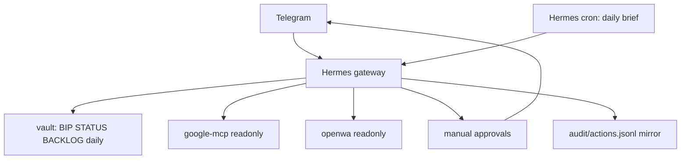

# Bip Sidekick - Hermes-native reference architecture

Bip Sidekick is a self-hosted, governed, read-only-first personal agent for solo builders
and consultants. It runs on a single VPS, reads from your real tools, writes to a plain
Markdown vault, and sends one prioritized next action to Telegram. It never sends, deploys,
spends, or mutates external systems without explicit approval.

This repo is a reference architecture, not a turnkey product. The deployment is Docker
Compose based and intentionally staged.

## Architecture



Hermes is the brain, Telegram gateway, cron runner, MCP client, and approval surface.
`/vault` remains Bip's durable memory and the human-readable source of truth.

## Components

| Service | Role | Acts? | Notes |
|---|---|---|---|
| `hermes` | Brain, Telegram gateway, cron, approvals | only via manual approval | Built from `services/hermes/` |
| `vault-sync` | Syncs the Obsidian vault git repo | no | Keeps Markdown memory portable |
| `google-mcp` | Calendar + Gmail senses | no | Read-only Google scopes |
| `openwa` | WhatsApp triage | no | Optional profile, `MCP_READONLY=true` |
| `vault` volume | `BIP.md`, `STATUS.md`, `BACKLOG.md`, `daily/` | n/a | Shared human/agent memory |
| `audit` volume | Approval/action mirror | n/a | JSONL contract for governed actions |

## Quickstart

Requirements: Ubuntu 22.04+ VPS, Docker, Docker Compose plugin, and a private vault git
remote.

```bash
git clone https://github.com/suporterfid/bip-sidekick.git
cd bip-sidekick
cp .env.example .env
./scripts/bootstrap.sh
make up-core
```

Then verify the gate posture:

```bash
make up-gate
make logs SVC=hermes
```

WhatsApp triage remains optional:

```bash
make up-openwa
make logs SVC=openwa
```

## Governance

- Read-only first: Google and OpenWA are configured as senses, not hands.
- Telegram allowlist: only configured users can interact with Bip.
- Manual approvals: dangerous interactive tools require a tap.
- Cron deny: scheduled briefs must not act.
- Audit posture: actions must be mirrored to `/audit/actions.jsonl` before real hands are
  enabled.

Stage 5 send/deploy/spend tools are tracked separately. If a hand cannot be approval-gated
and audited, do not attach it.

## Repository Layout

```text
bip-sidekick/
  docker-compose.yml
  Makefile
  .env.example
  docs/
    ARCHITECTURE.md
    ROADMAP.md
    SECURITY.md
    adr/
  services/
    hermes/
    google-mcp/
    openwa/
    agent/              # superseded historical stub
    telegram-bridge/    # superseded historical stub
    brief-engine/       # superseded historical stub
  vault/
    BIP.md
    CLAUDE.md           # compatibility pointer
    STATUS.md
    BACKLOG.md
    daily/
  scripts/
```

## Non-Goals

- No opportunity engine or autonomous work discovery.
- No autonomous spending.
- No self-modifying loops.
- No public dashboard by default.
- No WhatsApp customer bot as core functionality.

## License

MIT. Review `docs/SECURITY.md` before pointing the stack at real accounts.
