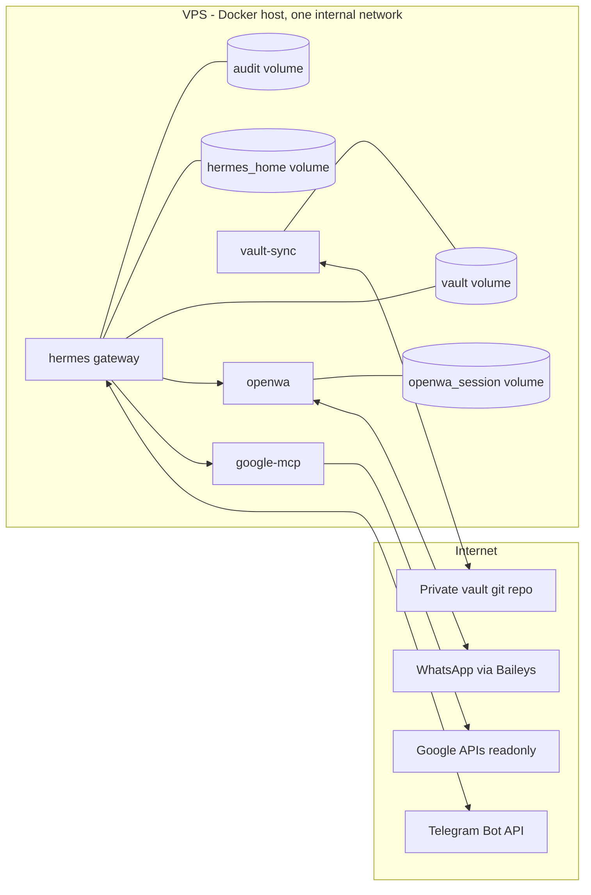
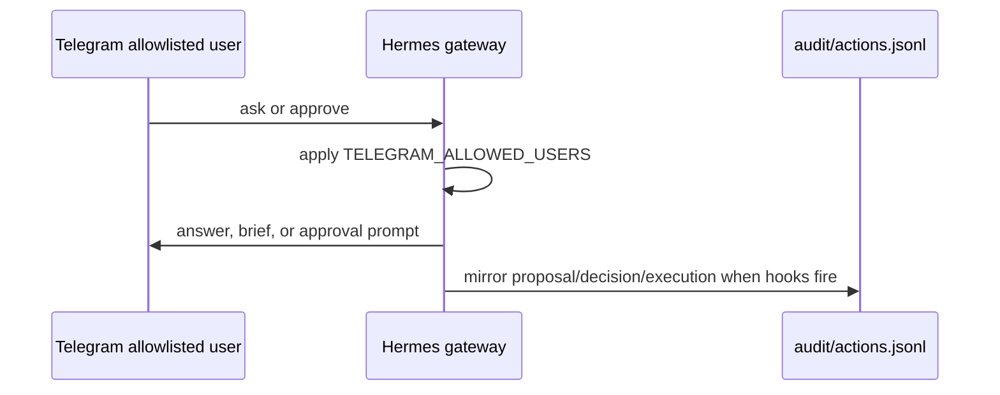
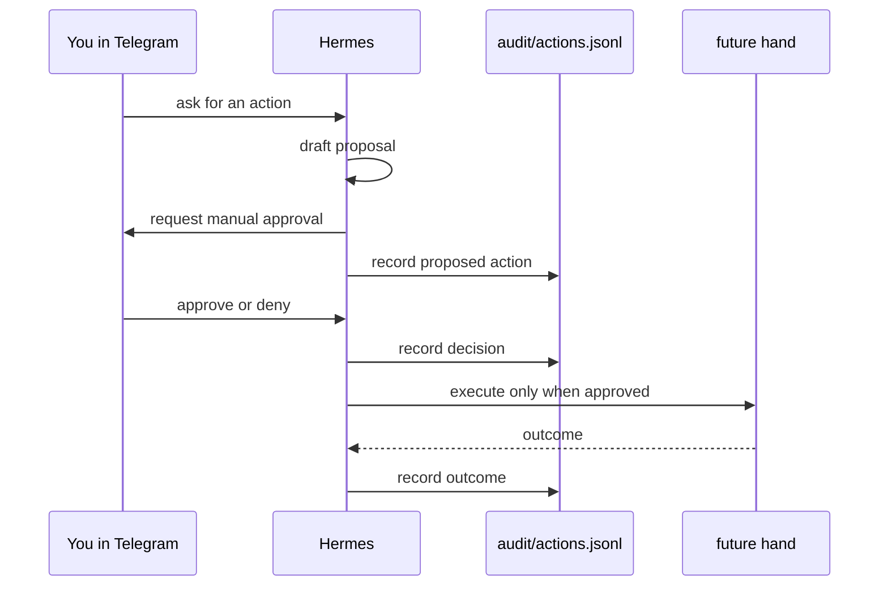

# Architecture

## Deployment Topology



All services live on one internal Docker network. No Hermes dashboard or API port is
published by default. `openwa` is only started through the `openwa` profile.

`services/agent`, `services/telegram-bridge`, and `services/brief-engine` are historical
runtime stubs. They are not active agent services in the current Compose topology; Hermes
owns the gateway, cron, MCP session, approval, and shell surfaces.

## Daily Brief Flow

```mermaid
sequenceDiagram
    participant Cron as Hermes cron
    participant H as Hermes
    participant G as google-mcp
    participant WA as openwa
    participant Vault as vault
    participant TG as Telegram

    Cron->>H: run Bip daily brief prompt
    H->>Vault: read BIP, STATUS, BACKLOG, daily notes
    H->>G: read calendar and Gmail
    H->>WA: read WhatsApp context when enabled
    H->>H: choose one next action
    H->>Vault: write daily/YYYY-MM-DD.md
    H->>TG: send brief
    Note over Cron,H: cron_mode=deny; no actions from scheduled jobs
```

The scheduled brief is advisory. It may read Google and optional WhatsApp context, update
`/vault/daily/YYYY-MM-DD.md`, and deliver the same summary to Telegram. It must not send
email, send WhatsApp messages, deploy, spend money, delete data, or mutate external
systems.

## Telegram and Approval Flow



Telegram is both the command inbox and the manual approval surface. `TELEGRAM_CHAT_ID`
remains a compatibility input, but runtime allowlisting is expressed through
`TELEGRAM_ALLOWED_USERS`; the entrypoint maps the chat id into the allowlist when the
allowlist is empty.

## Gated Action Flow



Real send/deploy/spend hands are not attached during Stages 1-4. Stage 5 adds each hand
separately only when it can be approval-gated and audited.

## MCP Read-only Flow

Hermes reaches MCP servers by internal DNS names: `http://google-mcp:8081/mcp` for Google
and `http://openwa:3000/mcp` when the optional WhatsApp profile is enabled. Google scopes
are Gmail and Calendar read-only. OpenWA runs with `MCP_READONLY=true`. Hermes config also
excludes send, create, update, delete, reply, deploy, and spend-style tools during the
read-only stages. See `docs/MCP.md` for the read-only MCP contract and validator.

## Component Detail

### hermes

Hermes is Bip's runtime: gateway, Telegram surface, cron runner, MCP client, session
state, shell context, and approval layer. It is packaged by `services/hermes/Dockerfile`
and stores runtime state in `hermes_home`.

### vault

The vault is the durable shared memory. `vault/BIP.md` is Bip's provider-neutral identity
source. `vault/CLAUDE.md` remains as a compatibility pointer. Hermes generates runtime
`SOUL.md` from `BIP.md` on startup.

### google-mcp

Google MCP exposes Calendar and Gmail with read-only scopes only. Widening scopes requires
a new ADR and a Stage 5 hand with approval and audit.

### openwa

OpenWA is optional WhatsApp read-only triage. It runs with `ENGINE_TYPE=baileys` and
`MCP_READONLY=true`. Use a spare number because WhatsApp Web automation carries ban risk.

### audit

`/audit/actions.jsonl` is the Bip governance contract. Hermes logs may be useful, but real
hands stay disabled until proposed, approved, denied, and executed events can be audited.

### shell

Shell access is container-scoped inside `bip-hermes`. The Docker socket, broad host
filesystem mounts, host devices, host namespaces, privileged mode, and public Hermes ports
are not part of the default deployment. See `docs/SHELL.md` for the boundary contract.
