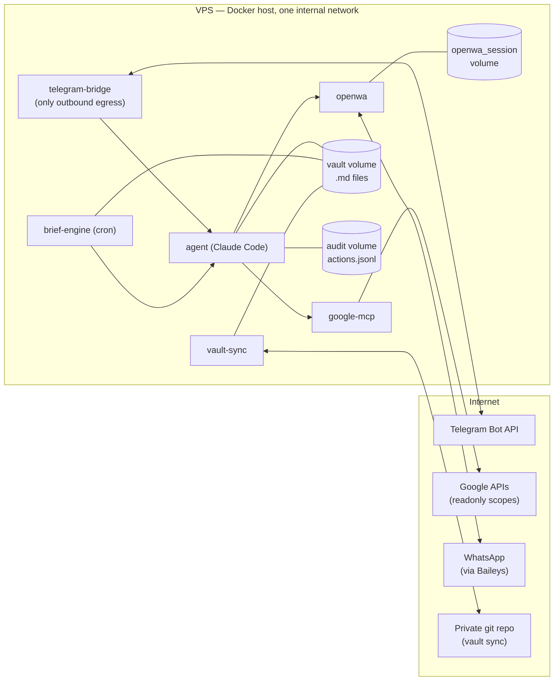
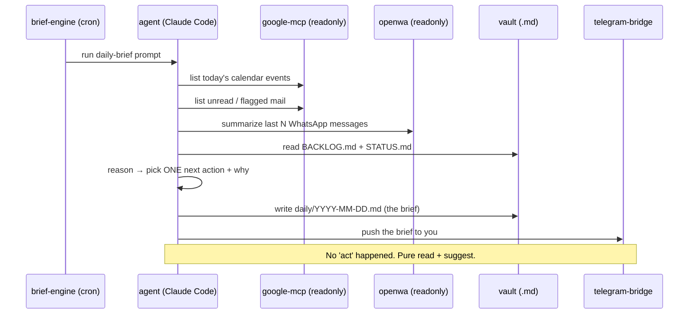
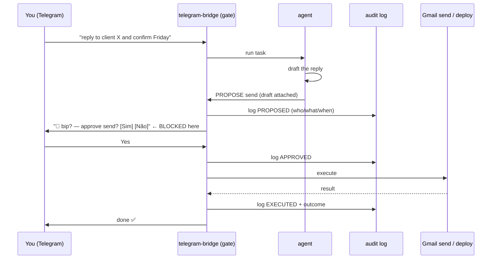

# Architecture

## Deployment topology (single VPS)

**Networking notes**
- One internal Docker bridge network. Services address each other by name.
- `telegram-bridge` is the only service that *needs* general outbound internet
  (to reach the Telegram Bot API). `google-mcp` and `vault-sync` reach specific
  Google/git endpoints; `openwa` maintains the WhatsApp Web connection.
- Nothing is published to the host's public interface by default. There is no inbound
  web surface unless you add a reverse proxy for OpenWA's admin UI (optional, protect it).

---

## Data flow: the daily brief (the core value)

## Data flow: an action that changes the world (gated)

The gate is the single choke point: **no "act" tool is reachable except through a
Telegram approval.** See [SECURITY.md](SECURITY.md).

---

## Component detail

### agent (the brain)
Claude Code running headless on the VPS, orchestrated by the Hermes framework in a
persistent session (tmux for interactive attach; a small HTTP shim on `:8080` for the
brief-engine and bridge to invoke tasks). Reads MCP servers registered in
`mcp/.mcp.json`. Writes to the vault and the audit log. **Never** holds send/deploy
credentials directly — those live behind the gate.

### google-mcp (senses: Calendar + Gmail)
A self-hosted Google Workspace MCP server. On a headless VPS you do **not** get the
claude.ai managed connectors, so you run this with your own OAuth2 credentials and a
refresh token minted with **read-only scopes only** (`gmail.readonly`,
`calendar.readonly`). Widening scopes is a deliberate, documented decision (add an ADR).

### openwa (senses: WhatsApp triage)
Your fork of OpenWA, run with `ENGINE_TYPE=baileys` (websocket, no headless Chromium →
lighter on a small VPS) and `MCP_READONLY=true`. The agent can *read and summarize*
messages; it cannot send. Same account-ban caveat as any WhatsApp-Web-based gateway —
use a spare number. See [SECURITY.md](SECURITY.md#whatsapp).

### vault (memory)
An Obsidian vault = a folder of `.md` files. On the VPS the agent operates on the files
directly (no Obsidian GUI needed; the Local REST API/MCP plugin requires the desktop app
and is for your laptop/phone side). `vault-sync` pushes/pulls a **private** git repo on
an interval so Obsidian on your devices stays current. Seeded files: `STATUS.md`,
`BACKLOG.md`, `CLAUDE.md`, and `daily/`.

### telegram-bridge (command inbox + gate)
Single entry point from your phone, with a **chat allowlist** (only your `TELEGRAM_CHAT_ID`
is honored). Holds pending-approval state, executes approved actions, and writes the
append-only audit log.

### brief-engine (daily job)
A cron container that, on schedule, invokes the agent's daily-brief prompt and makes sure
the result reaches both the vault and your Telegram.

---

## Why single-host

At solo scale, one VPS with Docker Compose is the right granularity: cheap, easy to
reason about, trivially backed up (it's markdown + a couple of volumes). If you ever
outgrow it, the seams to split are obvious (senses, brain, gate), but **don't
pre-split** — that's the enterprise complexity this design exists to avoid.
