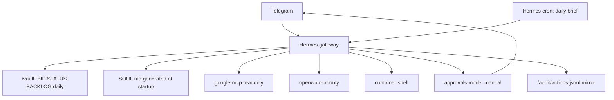

# Hermes-Native Governed Migration Design

## Purpose

Migrate Bip Sidekick directly from the current stubbed runtime (`agent`, `telegram-bridge`,
and `brief-engine`) to a Hermes-native runtime while keeping the deployment fully
Dockerized. Hermes becomes the central brain, Telegram gateway, cron runner, and approval
surface. The existing project principles remain unchanged: read-only first, one daily next
action, explicit approval for anything that acts, and a human-readable vault as shared
memory.

This design implements the governed migration path. The expanded path is tracked in GitHub
issues #1-#10; this spec starts with the safer subset needed to make Hermes the primary
runtime without adding real send/deploy hands yet.

## Scope

In scope:

- Add a repo-owned `services/hermes/` Docker package based on the official Hermes image.
- Replace the active Compose `core` runtime services with a single `hermes` service.
- Keep `vault-sync`, `google-mcp`, and `openwa` as sibling services on the internal Docker
  network.
- Introduce `vault/BIP.md` as the provider-neutral Bip identity source.
- Generate Hermes `SOUL.md` during container startup from `vault/BIP.md`, with a versioned
  fallback template.
- Configure Telegram allowlist, manual approvals, cron deny behavior, MCP read-only access,
  and container-scoped shell.
- Preserve the `audit` volume and define the expected JSONL audit mirror contract.
- Update README, architecture, roadmap, security docs, and ADRs to describe Hermes-native
  operation.

Out of scope for this first implementation:

- Real Gmail, WhatsApp, deploy, or spend hands.
- Host Docker socket access from Hermes.
- Public Hermes dashboard exposure.
- Replacing the Obsidian vault with Hermes memories.
- Removing superseded service directories before the migration is proven.

## Target Architecture

Hermes runs inside Docker as `bip-hermes`. Its persistent home is mounted from a Docker
volume, while durable user-facing memory remains `/vault`. Hermes may use its own memories
or sessions internally, but `/vault` remains the source of truth for prioritization,
identity, daily notes, and human review.

## Docker Package

Add `services/hermes/Dockerfile` as a thin, repo-owned wrapper around the official Hermes
image. The wrapper should install only small runtime helpers needed by the entrypoint,
copy templates into the image, and set the project entrypoint.

Expected local files:

- `services/hermes/Dockerfile`
- `services/hermes/entrypoint.sh`
- `services/hermes/templates/BIP.md`
- `services/hermes/templates/config.yaml`
- `services/hermes/templates/cron/daily-brief.md` or equivalent Hermes cron template
- `services/hermes/README.md`

The container writes generated runtime config into the mounted Hermes home, not into the
repo. Startup should be idempotent: existing user config is preserved unless the entrypoint
is explicitly designed to regenerate a derived file such as `SOUL.md`.

## Compose Shape

The `core` profile should include:

- `vault-sync`
- `google-mcp`
- `hermes`

The `openwa` profile remains optional and adds WhatsApp read-only triage. The `agent`,
`telegram-bridge`, and `brief-engine` services are removed from active Compose profiles or
left clearly superseded and inactive during the transition.

Hermes volumes:

- `hermes_home:/opt/data` for Hermes config, generated `SOUL.md`, sessions, cron state,
  memories, and logs.
- `vault:/vault` for Obsidian memory and daily notes.
- `audit:/audit` for the Bip audit mirror.

Hermes environment:

- `ANTHROPIC_API_KEY` or another Hermes-supported provider key.
- `TELEGRAM_BOT_TOKEN`.
- `TELEGRAM_ALLOWED_USERS`, mapped from `TELEGRAM_CHAT_ID` for compatibility.
- `BRIEF_CRON`.
- `TZ`.

No dashboard or application port should be published by default. If a dashboard is ever
enabled, it must be private, authenticated, and documented separately.

## Bip Identity

`vault/BIP.md` is the provider-neutral source of truth for Bip's operating instructions.
It should describe Bip as a sidekick, not a boss, and include the read-only-first policy,
daily brief behavior, vault-first prioritization, approval voice, and limits on acting.

At startup:

1. If `/vault/BIP.md` exists, generate Hermes `SOUL.md` from it.
2. If `/vault/BIP.md` is missing, copy the fallback template to `/vault/BIP.md`.
3. Generate Hermes `SOUL.md` from the resulting `/vault/BIP.md`.
4. Keep `vault/CLAUDE.md` as a short compatibility pointer to `BIP.md`.

The generated `SOUL.md` should add Hermes-specific runtime notes, including:

- `/vault` is the source of truth for priorities and daily notes.
- Hermes memories are optional scratch and must not replace the vault.
- Cron briefs are read-only and must not execute actions.
- Dangerous tools require manual approval.

## Hermes Configuration

The configuration must lock in these policies:

- Telegram allowlist uses only the user's allowed Telegram ID.
- `approvals.mode` is manual for dangerous tools.
- Cron action behavior is deny, so scheduled jobs cannot act.
- MCP servers are reachable only on the internal Docker network.
- Google MCP is read-only.
- OpenWA MCP is read-only when enabled.
- Tool filters exclude send, mutate, deploy, or spend tools during Stages 1-4.
- Shell is allowed only inside the Hermes container context.

Because Hermes schema can evolve, implementation must verify field names against current
Hermes documentation during the edit. The repo should prefer explicit config templates over
implicit defaults wherever safety depends on the setting.

## Shell Policy

Shell is allowed in the Hermes container because the user explicitly wants it available.
The day-one shell boundary is still conservative:

- No Docker socket mount.
- No broad host filesystem bind mount.
- No host SSH key mount by default.
- Shell can inspect and edit intended mounted paths such as `/vault` and `/audit`.
- Dangerous shell actions should be routed through Hermes manual approvals where supported.
- Cron prompts must not use shell to perform actions.

If future work needs host-level deploys or Docker control, that belongs in Stage 5 as a
separate hand with least-privilege credentials, manual approval, and audit logging.

## Daily Brief

The daily brief moves from `brief-engine` into Hermes cron. The brief prompt must:

- Read `/vault/STATUS.md`, `/vault/BACKLOG.md`, and recent daily notes.
- Read Calendar and Gmail through Google MCP.
- Optionally read WhatsApp through OpenWA MCP when the `openwa` profile is enabled.
- Pick exactly one next action.
- Explain why in two or three concise sentences.
- Write `/vault/daily/YYYY-MM-DD.md`.
- Send the same brief to Telegram.
- Avoid sends, deploys, spending, or other mutations.

Failures should be visible in Hermes logs. A failed brief should not silently claim success
or create an empty daily note.

## Audit Contract

The current Bip architecture promises `audit/actions.jsonl` for proposed, approved, denied,
and executed actions. Hermes-native logs may not match that format out of the box, so the
migration must make the gap explicit.

Minimum governed migration requirement:

- Keep the `audit` volume.
- Keep `/audit/actions.jsonl` as the intended Bip audit mirror path.
- Document whether the first implementation writes native JSONL immediately or relies on
  Hermes logs until an audit mirror adapter is added.
- Do not enable real send/deploy hands until auditable approval records are proven.

Target JSONL fields:

- `timestamp`
- `event`
- `actor`
- `proposal`
- `tool`
- `approval_message_id`
- `outcome`
- `error`

## Documentation Updates

Add `docs/adr/ADR-004-hermes-native-runtime.md` to record the decision. Update:

- `README.md`
- `docs/ARCHITECTURE.md`
- `docs/ROADMAP.md`
- `docs/SECURITY.md`
- `.env.example`
- `Makefile`
- Superseded service READMEs for `services/agent`, `services/telegram-bridge`, and
  `services/brief-engine`

Docs should say that the custom HTTP `/run` shim is no longer the primary runtime path.
They should also make clear that the expanded Stage 5 hands remain future work until the
approval and audit guarantees are proven.

## Migration Stages

Stage 1: Hermes core runtime

- Add `services/hermes/`.
- Add Compose service and Makefile updates.
- Start Hermes with Telegram allowlist and vault mounted.

Stage 2: Bip identity and daily brief

- Add `vault/BIP.md`.
- Generate Hermes `SOUL.md`.
- Move daily brief into Hermes cron.
- Confirm the brief writes to `/vault/daily/` and sends to Telegram.

Stage 3: Governance proof

- Confirm manual approval for dangerous interactive tools.
- Confirm cron deny behavior.
- Define or implement the audit mirror.
- Keep send/deploy hands unavailable.

Stage 4: Optional OpenWA read-only triage

- Keep OpenWA behind the `openwa` profile.
- Confirm `MCP_READONLY=true`.
- Add WhatsApp summary to the daily brief.

Stage 5: Future expanded hands

- Add each send/deploy/spend hand as a separate issue.
- Require manual approval and audit for each.
- Do not attach a hand that cannot be gated.

## Testing And Verification

Static checks:

- `docker compose config`
- shell syntax check for `services/hermes/entrypoint.sh`
- documentation consistency checks for removed service names where practical

Runtime checks:

- `make up-core` starts Hermes, vault sync, and Google MCP.
- Hermes can read `/vault/BIP.md`.
- Hermes generates runtime `SOUL.md`.
- Telegram allowlist is configured.
- Daily brief can write a note and send a Telegram message.
- Dangerous interactive tools require manual approval.
- Cron cannot execute dangerous tools.

Security checks:

- No Docker socket mount.
- No public ports by default.
- No send/deploy/spend tools in Stages 1-4.
- Google and OpenWA remain read-only.

## Open Questions For Implementation

- Exact Hermes config field names must be verified against the current Hermes schema during
  implementation.
- The best audit mirror mechanism may depend on Hermes log/event hooks available in the
  image version used.
- The official Hermes image tag should be pinned after initial validation instead of left
  on `latest`.
